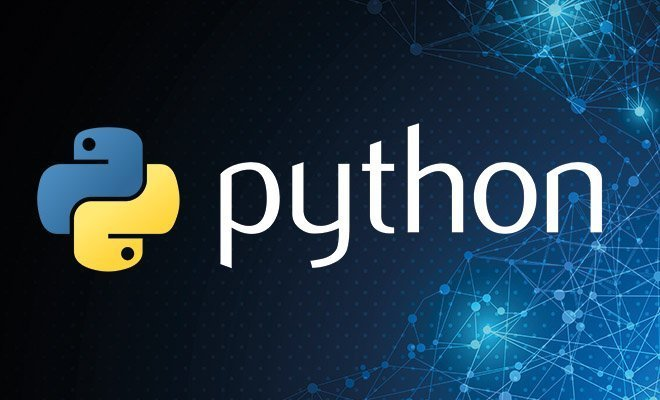

<!--
layout: workshop
titel: Python Flask Restful Api
social-media-untertitel: Asynchronen Workshop
datum: 2021-06-22
modul: wt
autor: Javad Alamdar
bild: ../pyhton.jpg
art: workshop
termin: 
dauer: 120-150 Minuten 
raum: https://th-koeln.zoom.us/j/89337586017?pwd=L2hBbmczaWJ6TStkUjMxTHlRc0ZhUT09
-->

# Restful Api mit Flask in Python

Coach: Javad Alamdar 
Dauer: 120-150 Minuten 
Termin: Asynchronen Workshop 

---

Diese Repository beinhaltete die Materialien für den Workshop ["Restful API mit Flask in Python"](https://javadalam.github.io/WT_Workshop_Rest-API-mit-Flask-in-Python/) für den Kurs Webtechnologien im Master Medieninformatik an der TH Köln.

---

In diesem Workshop wird das Thema *Restfull API mit Flask in Python* vorgestellt. Es soll ein Überblick über das Thema gegeben werden und wie man damit umgeht. Mit Hilfe von Übungen sollen die Teilnehmer das vorgestellte Thema innerhalb des Workshops vertiefen können.

Aufgrund dem Anwendungsbereich von *Flask* richtet sich der Workshop stärker an Backend Entwickler. Kenntnisse von *Flask und REST* erleichtern den Einstieg, sind aber keine muss, um mit *Flask in Python* durchzustarten. Am Ende dieses Workshops wird jeder Teilnehmer seine eigene RestAPI mit Flask entwickeln.

---

## Vorraussetzungen
- IDE : [VSCode](https://code.visualstudio.com/download) installieren 
- Browser :  (Im Workshop benutze ich Chrome)

## Vorbereitungen
- [Python](https://www.python.org/downloads/) für VSCode installieren 
- [Postman](https://www.postman.com/downloads/) installieren (Optional)
- [Github Repo zum Workshop](https://github.com/javadalam/WT_Workshop_Rest-API-mit-Flask-in-Python) clonen 

## Material
- Python [Dokumentation](https://docs.python.org/3/)
- Flask [Dokumentation](https://flask.palletsprojects.com/en/2.0.x/)
- Postman [Dokumentation](https://learning.postman.com/docs/publishing-your-api/documenting-your-api/)
- [Github Repo mit Übungen](https://github.com/javadalam/WT_Workshop_Rest-API-mit-Flask-in-Python/main/Aufgaben)
- [Folien](https://github.com/javadalam/WT_Workshop_Rest-API-mit-Flask-in-Python/main/Folien) 
- [Aufzeichnung](https://github.com/javadalam/WT_Workshop_Rest-API-mit-Flask-in-Python/tree/main/Aufzeichnungen) herunterladen 